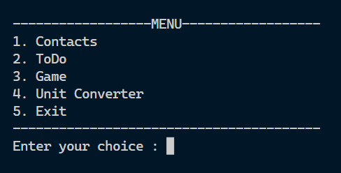
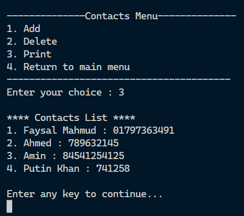
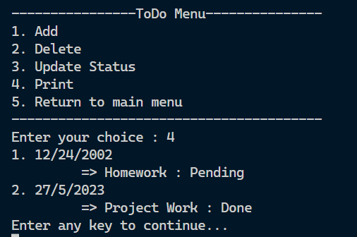
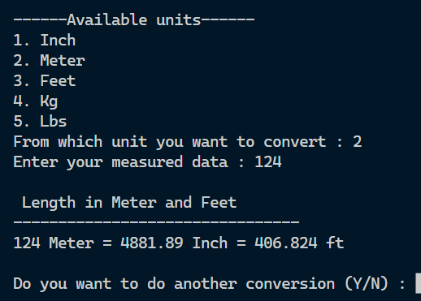
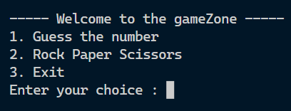
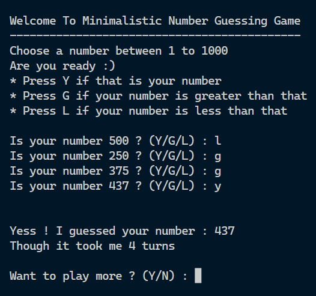
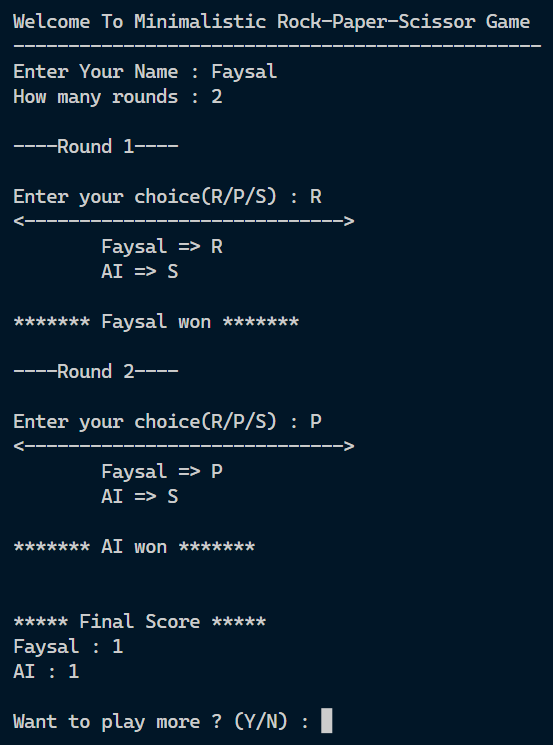

<h1 align="center">NOKIA_1100</h1>

This repository is for the 2nd year 1st term OOP Project.

- <b><i>Run the main.cpp file</i></b>
- **All the necessary code blocks are split into multiple header files(.hpp)[no need for makefile]**

<h2> Description </h2>
In this project, I have implemented the CRUD operation. This is basically the Creation, Reading, Updating and Deletion of file data. I also used four fundamental OOP concepts: Inheritance, Abstraction, Polymorphism and Encapsulation. The template function and RTTI (Dynamic Casting) are also applied. I have also implemented a number guessing game that uses the Binary Search Approach to figure out user's secretly chosen number. 

<h2> Features </h2>

<ol>

<li> Contacts List
    <ul>
        <li> Add Contact </li>
        <li>View All Contact</li>
        <li>Delete Contact</li>
    </ul>
</li>
<li> ToDo List
    <ul>
        <li>Add Task</li>
        <li>View All task</li>
        <li>Update Status (Pending / Completed)</li>
        <li>Delete Task</li>
    </ul>
</li>
<li> Games
    <ul>
        <li> Number Guess game (Uses Binary search approach to find out user's chosen number)</li>
        <li> Rock Paper Scissors Game (User Play VS Computer generates random Move)</li>
    </ul>    
</li>
<li> Unit Converter
    <ul>
        <li> Length (Inch - Meter - Feet) Converter</li>
        <li> Weight (Kg - Lbs) Converter</li>
    </ul>
</li>
</ol>

<h3 align="center"> Some Screenshots </h3>

